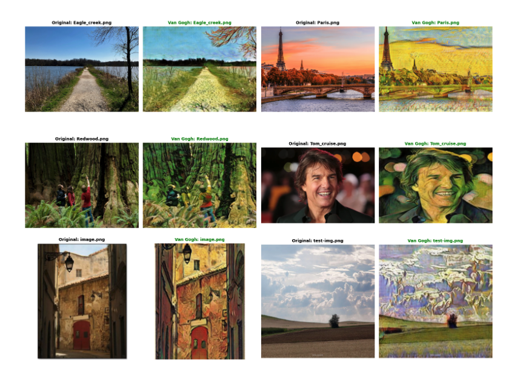
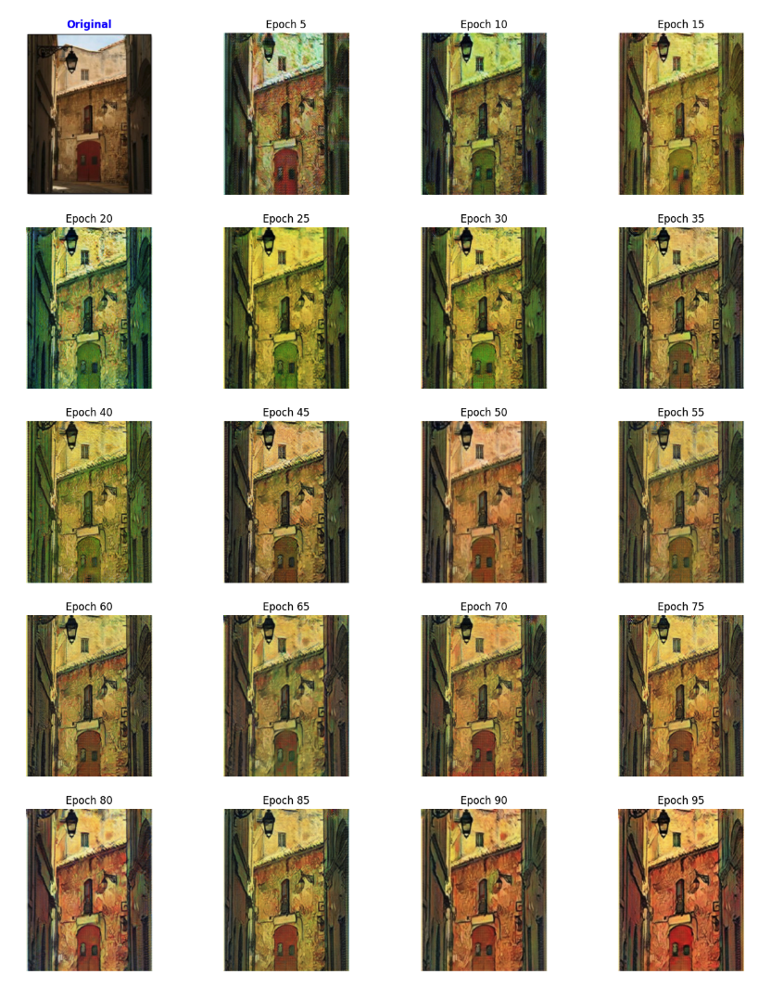
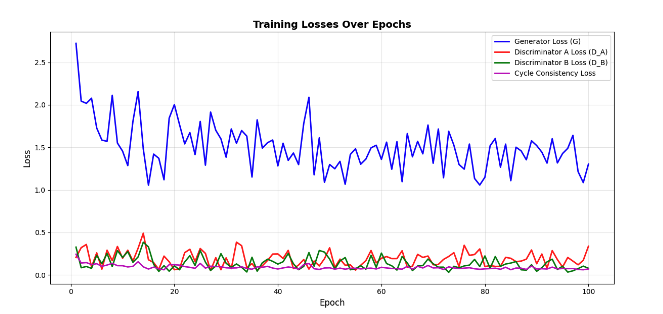
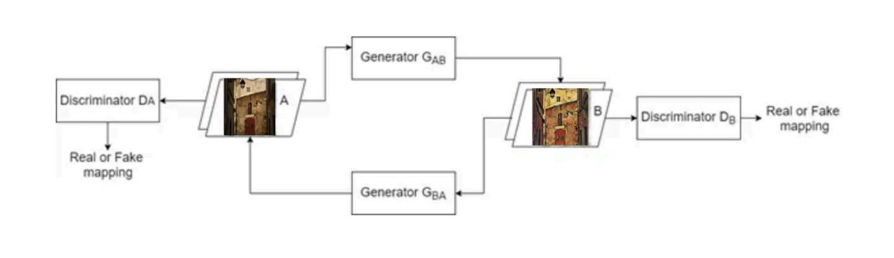

# CycleGAN — Van Gogh Style Transfer

A PyTorch implementation of CycleGAN trained end-to-end on Indiana University's **BigRed200 HPC cluster** (SLURM) to perform unpaired photo-to-Van Gogh style transfer.

---

## Results

### Style Transfer Outputs
*Top row: original photos. Bottom rows: Van Gogh stylized outputs. Works best on landscapes and natural scenery.*

### Training Progress (Epoch-by-Epoch)
*The model progressively learns Van Gogh's texture and color palette over 100 epochs.*

### Loss Curves (100 Epochs)
*Generator loss oscillates as expected in adversarial training. Cycle consistency loss and discriminator losses remain low and stable - indicating the cycle reconstruction constraint is successfully enforced.*

---

## Limitations

- Performs well on **landscapes and natural scenery** (foliage, skies, countryside)
- Degrades on **faces, people, and modern architecture** — the style overwhelms fine structural detail, producing artifacts
- Style transfer is one-directional to Van Gogh; it does not generalize to other artists without retraining

---

## Architecture

CycleGAN learns bidirectional mappings between two unpaired image domains (photos ↔ Van Gogh paintings) using two generators and two discriminators trained simultaneously.

| Component | Details |
|---|---|
| **Generator G_AB** | Photo → Van Gogh painting |
| **Generator G_BA** | Van Gogh painting → Photo |
| **Discriminator D_B** | Distinguishes real vs. fake Van Gogh images |
| **Discriminator D_A** | Distinguishes real vs. fake photos |

### Generator (ResNet-based)
- **Encoder**: Conv layers with stride-2 downsampling + Reflection Padding + Instance Normalization
- **Transformer**: 9 residual blocks for deep feature learning (no vanishing gradients)
- **Decoder**: Transposed convolution upsampling back to 256×256

### Discriminator (PatchGAN)
- Classifies overlapping **70×70 patches** as real or fake (not the full image)
- Focuses the generator on high-frequency textures and brushwork rather than global structure

### Loss Functions
| Loss | Purpose |
|---|---|
| **Adversarial (LSGAN)** | Forces generator outputs to be indistinguishable from real images |
| **Cycle Consistency** | Ensures A → G(A) → F(G(A)) ≈ A; preserves content structure |
| **Identity** | Keeps color/tone stable when domain is already the target |

---

## Training on HPC (SLURM / BigRed200)

Training was submitted as a SLURM batch job on **Indiana University's BigRed200 supercomputer** — a production HPC cluster used for large-scale research workloads. Trained it for 14 hours in a 4 core 32 GB VRAM Nvidia GPU for 100 epochs, with a batch size of 1.